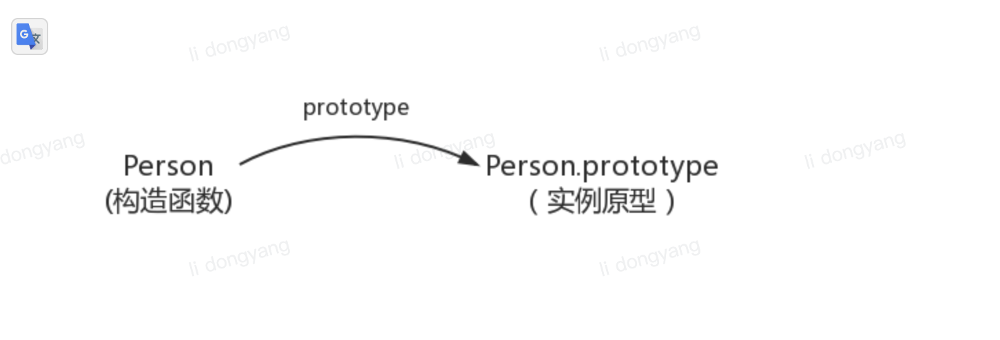
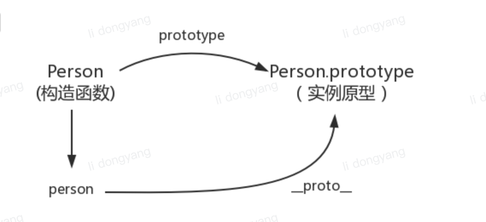
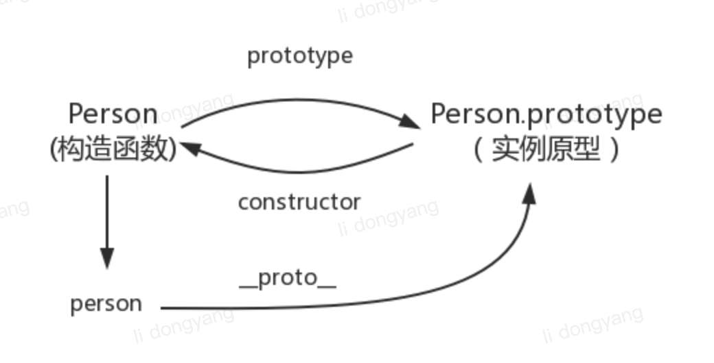
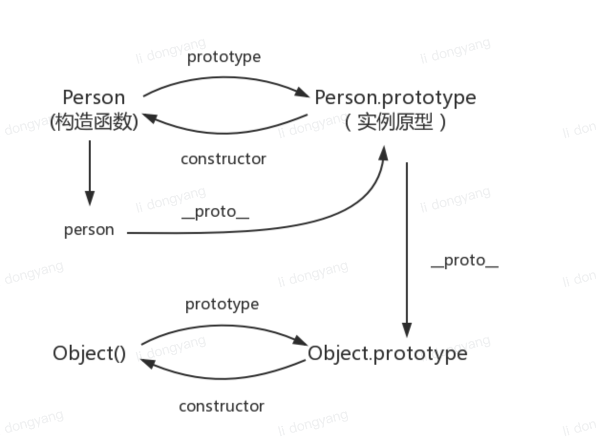
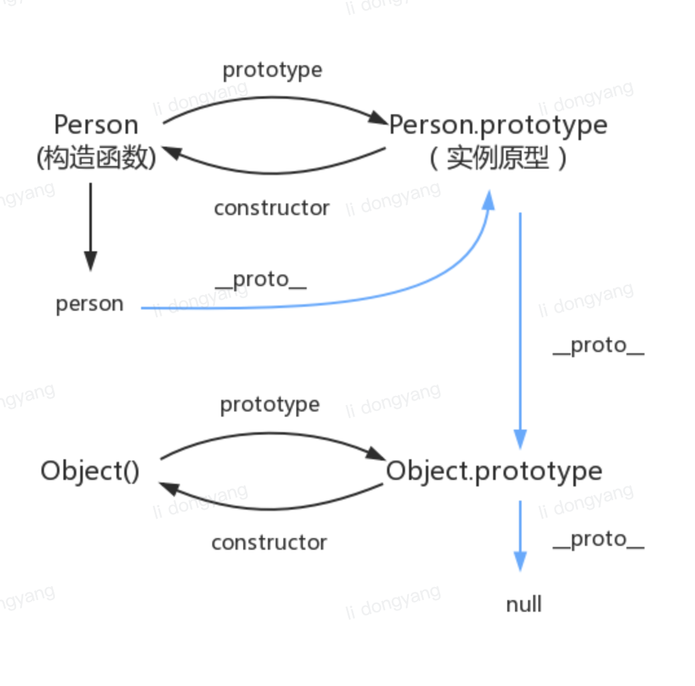

# this 指针/闭包/作用域

## 原型&原型链

我们先使用构造函数创建一个对象

```js
function Person() {}
var person = new Person();
person.name = "xiaoming";
console.log(person.name); // xiaoming
```

在这个例子中，Person 就是一个构造函数，我们使用 new 关键字创建了一个 Person 的实例对象 person。

在这个例子中，我们会发现，我们并没有在 Person 函数内部定义 name 属性，但是当我们给 person 添加 name 属性后，我们却可以通过 person.name 访问到这个属性。

<!-- 这是因为在 JavaScript 中，每个对象都有一个内部属性 `[[Prototype]]`，这个属性指向了另一个对象。当我们通过 person.name 访问一个属性时，如果 person 对象本身没有这个属性，那么 JavaScript 就会去 person 的 `[[Prototype]]` 对象中查找这个属性。这个 `[[Prototype]]` 对象就是 person 的原型对象。 -->

### prototype

每个函数都有一个 `prototype`属性, 比如:

```js
function Person() {}
// 虽然写在注释里，但是你要注意：
// prototype是函数才会有的属性
Person.prototype.name = "xiaoming";

var person1 = new Person();
var person2 = new Person();

console.log(person1.name); // xiaoming
console.log(person2.name); // xiaoming
```

那这个函数的 `prototype`属性到底指向的是什么呢？是这个函数的原型吗？
其实，函数的 `prototype`属性指向了一个对象，这个对象正是调用该构造函数而创建的实例的原型，也就是 `person1` 和 `person2` 的原型。

那什么是原型呢？ 你可以这样理解： 每一个 Javascript 对象(null 除外)在创建的时候就会与之关联另一个对象，这个对象就是我们所说的原型，每一个对象都会从原型"继承"属性。

用一张图表示构造函数和实例原型之间的关系：


### proto

这是每一个 Javascript 对象(除了 null)都具有的一个属性，叫`__proto__`, 这个属性会指向改对象的原型。

```js
function Person() {}

var person = new Person();

console.log(person.__proto__ === Person.prototype); // true
```



既然实例对象和构造函数都可以指向原型，那么原型是否有属性指向构造函数或者实例呢？

### constructor

指向实例倒是没有，因为一个构造函数可以生成多个实例，但是原型向构造函数是有的: `constructor`，每个原型都有一个 `constructor` 属性指向关联的构造函数

```js
function Person() {}
console.log(Person === Person.prototype.constructor); // true
```



所以，这里可以得到:

```js
function Person() {}
var person = new Person();
console.log(person.__proto__ == Person.prototype); // true

console.log(Person.prototype.constructor == Person); // true

console.log(Object.getPrototypeOf(person) === Person.prototype); // true
```

### 实例与原型

当读取实例的属性时, 如果找不到, 就会查找与对象关联的原型中的属性, 如果还查不到, 就去找原型的原型, 一直找到最顶层为止。

举个例子:

```js
function Person() {}

Person.prototype.name = "xiaoming";

var person = new Person();

person.name = "mingxiao";
console.log(person.name); // mingxiao

delete person.name;
console.log(person.name); // xiaoming
```

在这个例子中, 我们给实例对象 person 添加了 name 属性, 当我们打印`person.name`的时候, 结果自然为 `xiaoming`。
但是当我们删除了 person 的 name 属性时, 读取 `person.name` 从 person 对象中找不到 name 属性就会从 person 的原型也就是`person.__proto__`, 也就是`Person.prototype`中查找, 结果为`xiaoming`.

### 原型的原型

如果在原型上还没有找到呢？原型的原型又是什么呢？

```js
var obj = new Object();
obj.name = "xiaoming";
console.log(obj.name); // xiaoming
```

其实原型对象就是通过 Object 构造函数生成的,结合之前所讲，实例的`proto`指向构造函数的`prototype`, 所以我们再更新下关系图：


### 原型链

那 `Object.prototype`的原型呢?
null 我们可以打印

```js
console.log(Object.prototype.__proto__ === null); // true
```

然后 null 究竟代表了什么呢？
null 表示“没有对象”，即该处不应该有值。
所以 `Object.prototype.__proto__` 的值为 null 跟 `Object.prototype` 没有原型，其实表达了一个意思。
所以查找属性的时候查到 `Object.prototype` 就可以停止查找了。

最后一张图把之前的原型关系连在一起:


其中蓝色为原型链

### 其他

#### constructor

```js
function Person() {}
var person = new Person();

console.log(person.constructor === Person); // true
```

当获取 person.constructor 时，其实 person 中并没有 constructor 属性, 当不能读取到 constructor 属性时，会从 person 的原型也就是 Person.prototype 中读取，正好原型中有该属性，所以：

```js
person.constructor === Person.prototype.constructor;
```

#### `__proto__`

绝大部分浏览器都支持这个非标准的方法访问原型，然而它并不存在于 Person.prototype 中，实际上，它就是来自于 Object.prototype，与其说是一个属性，不如说是一个`getter/setter`, 当使用 `obj.__proto__`时，可以理解成返回了 `Object.getPrototypeOf(obj)`

#### 继承

关于继承，前面提到“每一个对象都会从原型‘继承’属性”，实际上，继承是一个十分具有迷惑性的说法，引用《你不知道的 JavaScript》中的话，就是：

> 继承意味着复制操作，然而 JavaScript 默认并不会复制对象的属性，相反，JavaScript 只是在两个对象之间创建一个关联，这样，一个对象就可以通过委托访问另一个对象的属性和函数，所以与其叫继承，委托的说法反而更准确些
