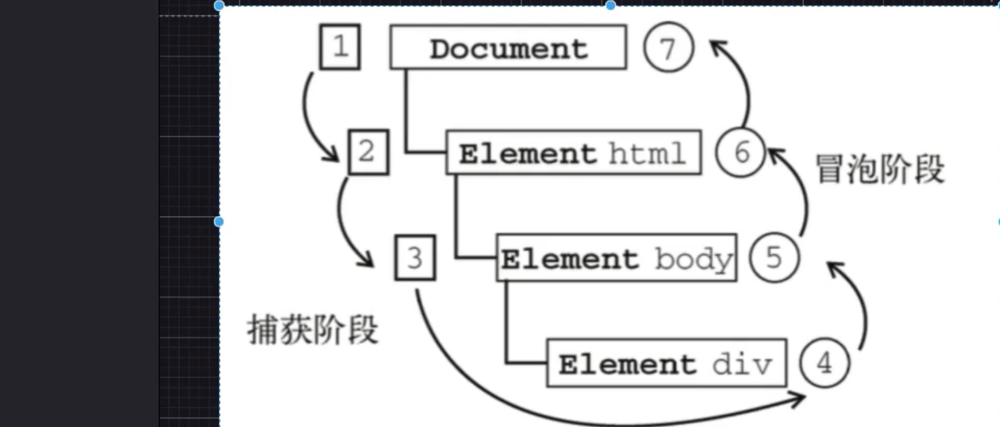

# 浏览器事件详解

## 浏览器事件模型

### DOM 事件

DOM 文档对象模型 层次化的节点数

#### DOM0 级事件

```js
btn.onclick = function () {
  console.log("this is click");
};

// 在react里 用的是onClick
// onClick 是react 合成事件 事件机制 为了实现浏览器的一致性 抹平不同浏览器之间差异

// 原生
<div onclick="handleClick"></div>

// react
<div onClick={handleClick}></div>

```

在 IE 中

```js
btn.onclick = function (e) {
  console.log(e);
};

btn.onclick = function () {
  console.log(window.event); // IE 事件对象
};
```

#### DOM1 级事件

#### DOM2 级事件

W3C 标准化

DOM2 级升级为队列 FIFO

DOM2 事件定义 2 个方法

- 处理指定事件 addEventListener
- 删除指定事件 removeEventListener

三个参数

- 事件名
- 事件处理函数
- 布尔值 true 在捕获阶段调用事件处理程序 false 在冒泡阶段调用事件处理程序 默认 false

```js
btn.addEventListener("click", function () {
  console.log("this is click1");
});

btn.addEventListener("click", function () {
  console.log("this is click2");
});

btn.removeEventListener("click", function () {
  console.log("remove");
});

// 匿名函数无法移除
// remove 只能移除具名函数  不能移除匿名函数
```

### 兼容处理

```js
if (typeof btn.addEventListener === "function") {
} else if (typeof btn.attachEvent === "function") {
} else {
  // DOM0
  btn.onclick = function () {};
}
```

### 总结

- DOM2 绑定多个事件
- DOM2 移除具名函数的绑定
- 触发顺序 DOM2 顺序执行 IE 相反的顺序执行

### 跨浏览器处理

```js
var EventUtil = {};
```

### 事件捕获 & 事件冒泡

事件流 表示从页面中接收事件的顺序

DOM2 级事件规定的事件流包括三个阶段

- 事件捕获阶段
- 处于目标阶段
- 事件冒泡阶段



- 阻止事件冒泡
- 阻止默认行为

```js
e.stopPropagation(); // 阻止事件冒泡   取消事件传播  事件不会传播到下一个节点，方法组织捕获和冒泡阶段
e.preventDefault(); // 阻止默认行为
```

阻止同一层级节点 不执行 linster

```js
div.addEventListener("click", function (e) {
  // 会阻止下一个eventListener的监听
  e.stopImmediatePropagation();
});

div.addEventListener("click", function (e) {});
```

### 事件对象

event 对象 两个属性

- target 添加事件的元素
- eventPhase 事件阶段

// CSS 差异 postCSS 库
//

## 浏览器请求

- ajax 异步请求处理 异步刷新数据
- fetch
- axios

### 手写 ajax

内部都是
xhr
XMLHttpRequest

- 创建一个兼容性 XMLHttpRequest 实例
- 设置请求的方式和地址
- open()

xmlHttp.open('GET/POST', 'ajax', true)

- 兼容 IE 场景 GET 请求 保证每次请求的数据都是最新的 每次请求的 url 不一致
- Math.random()
- new Date().getTime()
- url?t=new Date().getTime()

- 发送请求 xmlHttp.send()

- 监听状态变化
  onreadystatechange 监听异步对象请求码 readyState 变化

readyState 请求状态码

- 0~4
  - 0 请求未初始化
  - 1 服务器链接已建立
  - 2 请求已接收
  - 3 请求处理中
  - 4 请求已完成，且响应已就绪

status http 状态码 1xx - 5xx

请求成功
xmlHttp.status >= 200 < 300 || 304 请求成功

responseText 响应的数据

### fetch

ES6 出现的 fetch

差异点

- fecth 使用 promise 不适用回调函数的方式
- fetch API 分散多个对象 Response Request Headers
- fetch 通过数据流的方式 stream 对象

### 微前端

import-html-entry

一个主应用
子应用配置
htmlconfig

qiankun

- fetch(htmlconfig) 拿到 js css 资源

环境隔离

- shandbox js 做到沙箱机制 不会影响 window
- shadomroot 挂载 css
  多个子应用

#### stream 对象 只能读取一次 读取完就没有办法读取了

### axios

- 支持浏览器 node 请求
- node http
- browser XMLHttpRequest
